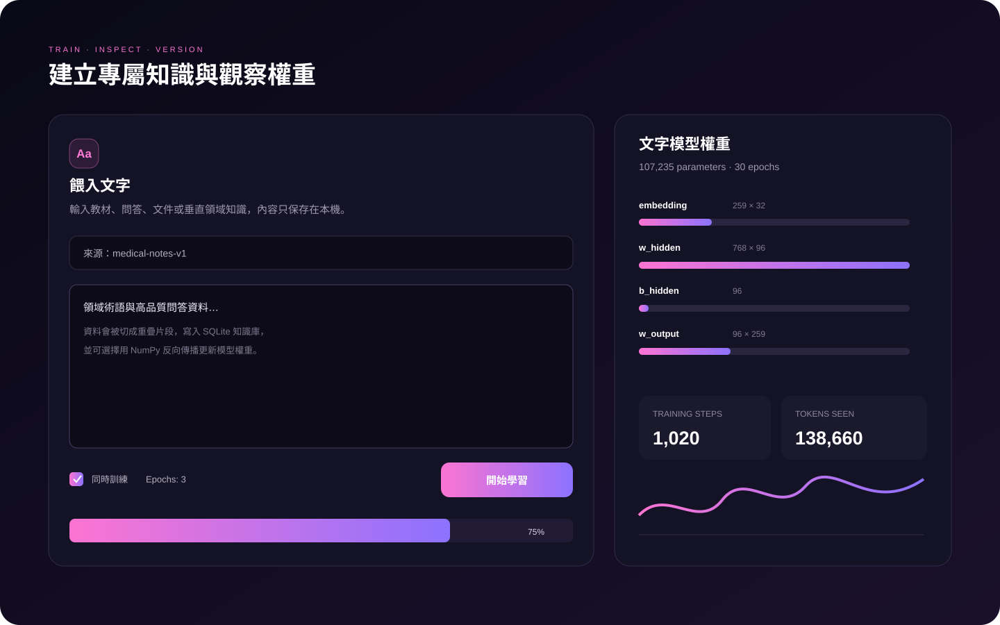
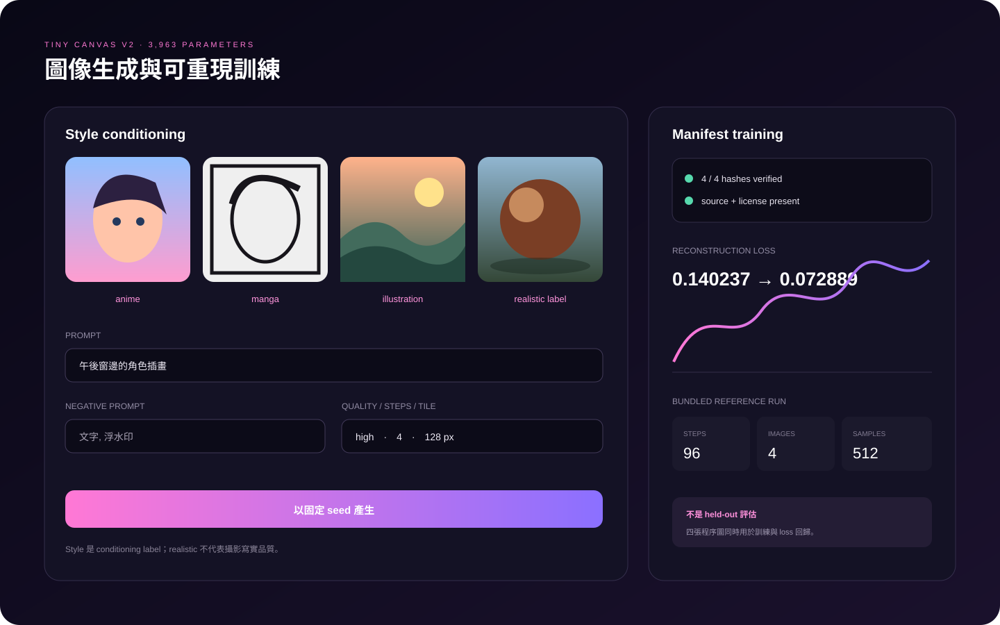
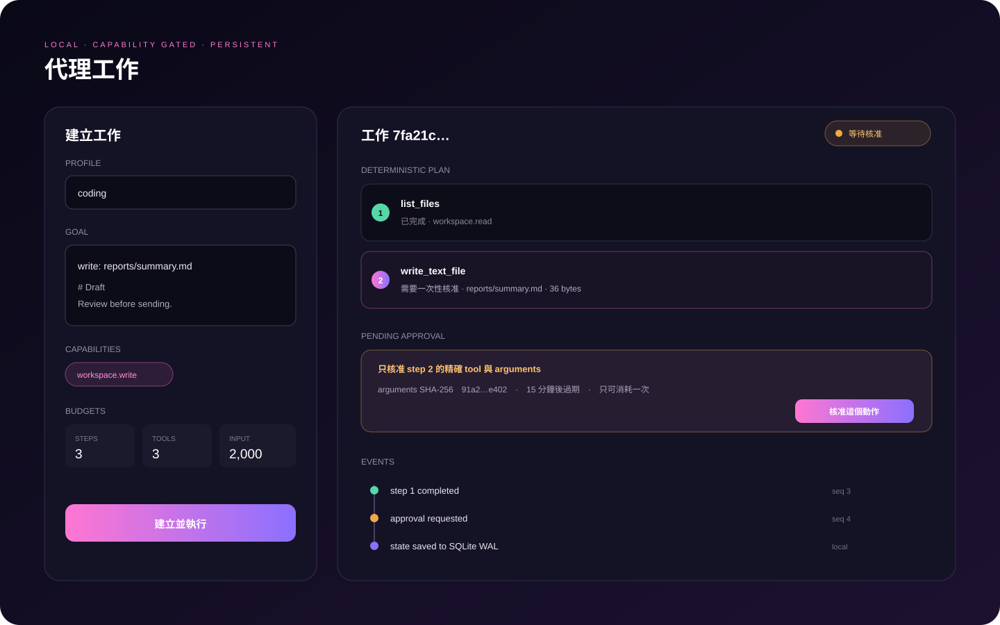

<p align="center">
  
</p>

<p align="center">
  <strong>可檢查、可訓練、可擴充的本機小型 AI 工作台</strong><br>
  不需要 AI API Key · Python、C、C++、Rust · Windows / Linux / macOS
</p>

<p align="center">
  <a href="#快速開始">快速開始</a> ·
  <a href="#python-嵌入-api">Python API</a> ·
  <a href="docs/TRAINING.md">文字訓練</a> ·
  <a href="docs/IMAGE_TRAINING.md">圖像訓練</a> ·
  <a href="docs/AGENTS.md">代理工作</a> ·
  <a href="docs/NATIVE_CORE.md">原生核心</a> ·
  <a href="https://github.com/YanagiKH/Momo-LM/releases">Releases</a>
</p>

> [!IMPORTANT]
> Momo-LM 隨附的文字與圖像權重很小，目的是讓一般電腦能檢查推論、訓練、權重與工具執行的完整路徑。專案沒有提出可與市場主流大型語言模型或擴散模型同級的評測證據。文字評估資料與 starter corpus 有重疊，不是獨立 held-out benchmark；它能證明訓練程式降低固定資料上的 next-token loss，不能證明日常對話品質或通用推理能力。圖像模型是小型座標網路，不是 diffusion model。

## 已實作的範圍

Momo-LM 在本機整合文字生成、檢索記憶、增量訓練、圖像生成與訓練、離線語音、受限代理工作、Mods、CLI、Web UI 與 Python API。它不包裝雲端 AI 服務，也不會要求 OpenAI、Anthropic 或其他 AI 供應商的 API Key。

| 功能 | 實作 | 預設網路行為 |
|---|---|---:|
| 文字生成 | 223,835 參數的 UTF-8 byte 模型；attention pooling、RMSNorm、8 組 gated neurons、residual output | 無 |
| 文字訓練 | deterministic AdamW、gradient clipping、replay、validation、原子 checkpoint | 無 |
| 本機知識 | SQLite 文件切塊、來源標記、CJK bigram 與關鍵詞檢索 | 無 |
| 圖像生成 | 3,963 參數的提示詞條件座標網路；anime、manga、illustration、realistic conditioning | 無 |
| 圖像訓練 | 授權 manifest、來源雜湊、deterministic NumPy backprop、validation | 無 |
| 原生運算 | C/C++/Rust 的矩陣、正規化、RoPE、attention、量化與取樣核心 | 無 |
| 代理工作 | training、coding、workplace、copilot profiles；白名單工具與一次性核准 | 無 |
| 文字轉語音 | Windows SAPI、Linux eSpeak，或測試用波形後備 | 無 |
| 網頁學習 | 使用者提供 URL 後才執行，同網域、`robots.txt`、頁數與大小限制 | 有 |
| Mods | 使用者放入指定目錄的可信任 Python 程式碼 | 由 Mod 決定 |

代理工具不包含任意 shell、背景上網、電子郵件傳送、雲端帳號操作或車輛／機器的實體控制。`workplace` 與 `copilot` 是本機檔案和模型工作流程，不是駕駛或自動操作外部系統的功能。

<p align="center"></p>

## 內附權重與評估解讀

安裝時會複製兩個安全 NPZ checkpoint：

| 檔案 | 格式 | 參數 | 用途 |
|---|---:|---:|---|
| `momo-text-base.npz` | v3 | 223,835 | next-token 生成與繼續訓練 |
| `momo-image-base.npz` | v2 | 3,963 | 四種風格條件的座標式圖像生成 |

Checkpoint 以 `allow_pickle=False` 載入。文字 v3 和圖像 v2 都保存張量形狀、dtype、byte 數與 SHA-256 manifest；載入器會拒絕缺少張量、形狀不符、非有限數值、解壓後過大或雜湊不符的檔案。兩種模型都使用原子替換保存；文字模型另外維護 last-good checkpoint 供載入失敗時回復。

可重現的訓練設定、評估定義、權重 SHA-256 與環境記錄放在 [`evals/`](evals/)。閱讀數字時請注意：

- 文字 validation 與專案 starter corpus 有內容重疊，不是未見資料。
- NLL、perplexity 與 token top-1 accuracy 衡量 next-token 預測，不衡量事實正確性、對話連貫性或安全性。
- 圖像 loss 衡量固定訓練樣本的像素／特徵重建，不是人類偏好、FID 或寫實品質評測。
- 基礎文字 checkpoint 的直接自由生成仍可能重複、偏題或產生亂碼。文件檢索能改善已匯入事實的回答，但不能補足模型容量。

## 快速開始

### 從原始碼安裝

需求：Python 3.10 以上。C/C++ 與 Rust toolchain 是可選項；缺少編譯器時會安裝 NumPy reference backend。

```bash
git clone https://github.com/YanagiKH/Momo-LM.git
cd Momo-LM
python -m venv .venv
source .venv/bin/activate
python -m pip install --upgrade pip
python -m pip install -e .
momo init
momo serve
```

Windows PowerShell 的啟用命令是：

```powershell
.\.venv\Scripts\Activate.ps1
python -m pip install --upgrade pip
python -m pip install -e .
momo init
momo serve
```

瀏覽器介面預設位於 `http://127.0.0.1:7860`。

### 使用安裝程式

每個 `v*` Release 會從對應 tag 建置：

- `Momo-LM-Setup-Windows-x64.exe`
- `Momo-LM-Setup-Linux-x64.run`
- `SHA256SUMS.txt`

請從 [GitHub Releases](https://github.com/YanagiKH/Momo-LM/releases) 下載並核對 SHA-256。未建立新 tag 前，`main` 上的功能不會出現在舊 Release。

## Python 嵌入 API

Python 識別字不能包含連字號，因此套件發行名是 `Momo-LM`，合法匯入名稱是 `momo_lm`。另保留 `MomoLM` 相容入口。

```python
import momo_lm

with momo_lm.load_model(home="./momo-data") as model:
    result = model.chat_result("你好，請簡短介紹自己", learn=False)
    print(result["response"])

    model.ingest(
        "產品代號 Peach 是本機推理引擎。",
        source="product-manual-v1",
    )
    model.train(
        "User: 產品代號 Peach 是什麼？\nMomo: 它是本機推理引擎。",
        epochs=3,
    )
    model.generate_image(
        "雨夜車站的漫畫分鏡",
        "station.png",
        style="manga",
        negative_prompt="文字浮水印",
        width=512,
        height=512,
        seed=42,
    )
```

相容入口：

```python
import MomoLM

with MomoLM.MomoLM.from_pretrained("./momo-data") as model:
    print(model("目前使用哪個運算後端？", learn=False))
    print(model.inspect()["compute_backend"])
```

公開 API 包含對話、訓練、資料匯入、圖像、語音、狀態與 context manager。代理 API 與權限模型見 [docs/AGENTS.md](docs/AGENTS.md)。

## Web 工作台

`momo serve` 提供本機單頁介面：

1. 對話：檢索本機資料後生成回答，並可關閉增量學習。
2. 代理：建立工作、查看計畫／事件／結果、核准單一受限動作或取消。
3. 資料：匯入 UTF-8 文字，或對明確 URL 執行受控 crawl。
4. 圖像：選擇 style、negative prompt、quality、steps、尺寸與 seed。
5. 語音：使用作業系統離線 TTS 產生 WAV。
6. 權重：顯示模型形狀、參數、訓練計數、張量統計與後端。
7. Mods：列出已載入命令、鉤子與隔離的錯誤。

<p align="center"></p>

所有 `/api/` 請求以及私有的 `/generated/`、`/speech/` 產物都需要 `X-Momo-Token`。Loopback 啟動未設定 token 時，伺服器會建立暫時 session token 並透過 URL fragment 交給工作台；綁定非 loopback 位址則必須明確設定持久 token。遠端部署還需 TLS、反向代理、防火牆與流量限制。`Host`、`Origin` 與 token 檢查不能取代安全的網路部署。

## 文字訓練

先把經常變動、需要來源的事實放入知識庫，再用小批高品質對話調整語氣與回應模式：

```bash
momo ingest data/domain-notes.txt
momo train data/domain-dialogues.txt --epochs 3 --learning-rate 0.0005
momo inspect
```

每次實驗應使用獨立 home，保存資料雜湊、設定、起始 checkpoint 與固定評測：

```bash
momo --home ./experiments/support init
momo --home ./experiments/support train data/support.txt --epochs 3
momo --home ./experiments/support inspect > experiments/support/result.json
```

不要把相鄰段落拆到 train 和 validation。內附 validation 是建置回歸測試，不能代替你的 held-out dataset。完整流程見 [docs/TRAINING.md](docs/TRAINING.md)。

## 圖像生成與訓練

```bash
momo image "午後窗邊的角色插畫" \
  --style illustration \
  --negative-prompt "文字, 浮水印" \
  --output character.png \
  --width 512 --height 512 --seed 42
```

支援的 conditioning label 是 `anime`、`manga`、`illustration`、`realistic`。`realistic` 是訓練類別名稱，不代表輸出已達攝影寫實品質。

圖像訓練 manifest 必須逐筆記錄相對檔案路徑、prompt、style、license、source 與 SHA-256。訓練器會拒絕路徑逸出、雜湊不符、未知 style、缺少授權或過大的影像。完整 schema、資料切分與命令見 [docs/IMAGE_TRAINING.md](docs/IMAGE_TRAINING.md)。

<p align="center"></p>

## 代理工作

代理把目標拆成固定類型的步驟，執行已註冊工具並把事件寫入 SQLite。可用 profiles：

- `training`：檢查資料與執行受限訓練流程。
- `coding`：讀取工作區、產生 patch 建議與測試報告。
- `workplace`：整理本機文件與建立輸出草稿。
- `copilot`：組合唯讀檢查與明確核准的寫入動作。

所有 profile 預設唯讀。寫檔或啟動訓練等動作需要該工作宣告 capability，且需要精確對應的一次性 approval。每項工作有步驟、工具呼叫與 goal 字元數 budgets；個別工具另有限制檔案與訓練輸入大小。工作可取消，重啟後能從持久化狀態恢復。詳情見 [docs/AGENTS.md](docs/AGENTS.md)。

<p align="center"></p>

## 原生運算後端

Python 路由依序嘗試 Rust、C++，最後退回 NumPy。可固定後端：

```bash
MOMO_BACKEND=rust momo backend
MOMO_BACKEND=cpp momo backend
MOMO_BACKEND=numpy momo backend
momo benchmark --size 512 --rounds 10
```

原生 ABI v2 包含 blocked matmul、stable softmax、LayerNorm、RMSNorm、RoPE、online causal attention、Q8 row quantization、deterministic top-k/temperature sampler 與 fused routed neuron groups。Python、C++ 和 Rust 路徑以 NumPy reference 做數值一致性測試。

`MOMO_REQUIRE_NATIVE=1` 會讓缺少或不相容的原生核心直接失敗，CI 與 Release 使用此設定。一般來源安裝未找到 toolchain 時仍可使用 NumPy。ABI、形狀契約與建置命令見 [docs/NATIVE_CORE.md](docs/NATIVE_CORE.md)。

## 受控網頁學習

```bash
momo crawl https://example.com/docs --max-pages 8
momo crawl https://example.com/docs --max-pages 8 --train
```

- 只有使用者執行 crawl 後才會連線。
- 只跟隨起始站點同網域的 HTTP/HTTPS 連結。
- 尊重 `robots.txt`，限制頁數、回應大小與 timeout。
- 預設只寫入知識庫；`--train` 才更新權重。
- 操作者仍須確認網站條款、著作權、個資與資料品質。

此 crawler 不會提供給代理工具，因此代理不能自行上網。

## 離線語音

```bash
momo tts "你好，我是 Momo。" --output momo.wav --rate 170
```

Windows 使用 SAPI；Linux 優先使用 `espeak-ng` 或 `espeak`。找不到系統語音時會輸出測試流程用的波形，不具自然人聲品質。

## Mods

可信任的 `.py` 檔可放入 `~/.momo-lm/mods/`。Mods 與主程式具有相同使用者權限，不是 sandbox。只載入自己撰寫或完整審查的程式碼。介面與測試方式見 [docs/MODS.md](docs/MODS.md)。

## 專案結構

```text
momo_lm/
├── model.py           # v3 文字模型、checkpoint 與生成
├── training.py        # deterministic AdamW 與評估
├── image_model.py     # v2 座標圖像模型
├── image_training.py  # manifest 驗證與圖像 backprop
├── agent*.py          # 代理、工具與持久化工作儲存
├── backend.py         # Rust / C++ / NumPy 路由
├── runtime.py         # 對話、檢索、訓練與工具整合
├── server.py          # 本機 HTTP API 與部署邊界
├── web/               # 無前端框架的工作台
└── assets/weights/    # 隨附的小型基礎 checkpoint
native/
├── include/           # C ABI v2
├── src/               # C kernels 與 C++ runtime
├── python/            # CPython bridge
└── rust/              # Rust kernels 與 C ABI
```

架構與資料流見 [docs/ARCHITECTURE.md](docs/ARCHITECTURE.md)。

## 開發與驗證

```bash
python -m pip install -e ".[dev]"
python scripts/build_native.py --release
python -m compileall -q momo_lm scripts tests
ruff check .
python scripts/validate_repo.py
python -m unittest discover -s tests -v
python -m build
```

GitHub Actions 執行：

- Windows／Linux × Python 3.10／3.12 測試。
- CMake／CTest、Cargo test、rustfmt 與 Clippy `-D warnings`。
- C/C++ AddressSanitizer 與 UndefinedBehaviorSanitizer。
- 從乾淨 sdist 模擬沒有 C/C++／Rust 編譯器的 NumPy-only 安裝。
- PyInstaller Windows／Linux 啟動測試，以及 Inno Setup 實際編譯。
- CodeQL Python 與 C/C++ 分析。

所有 workflow Action 固定到完整 commit SHA，並採用最小 `GITHUB_TOKEN` 權限。建議的分支保護設定與 required checks 見 [docs/BRANCH_PROTECTION.md](docs/BRANCH_PROTECTION.md)。

## 已知限制

- 223,835 個文字參數不足以承載大型模型的世界知識或長鏈推理；基礎自由生成仍不穩定。
- 目前評估不是獨立 held-out、人工偏好或安全 benchmark。
- 3,963 個圖像參數適合驗證訓練與風格 conditioning，不足以產生市場級動漫、漫畫、插畫或照片。
- 代理 planner 是受限、可重現的工作執行器，不會自行理解開放式職場流程，也不操作外部帳號或實體設備。
- Mods 是可信任程式碼，可能繞過應用層限制。
- 對外服務需要操作者自行配置 TLS、反向代理、防火牆與主機維護。

## 安全、貢獻與授權

不要把密碼、token、個資、機密文件或沒有再散布權的資料放進 prompts、manifest、checkpoint、設定檔、issue 或 Mods。漏洞請依 [SECURITY.md](SECURITY.md) 私下回報；一般變更流程見 [CONTRIBUTING.md](CONTRIBUTING.md)。

Momo-LM 以 [MIT License](LICENSE) 授權。資料集、第三方 Mods、外部 checkpoint 與系統語音可能有各自授權，使用者需逐項確認。
