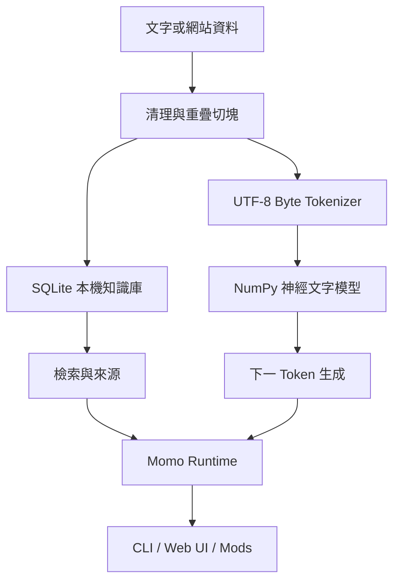

<p align="center">
  
</p>

<p align="center">
  <strong>從零實作、可訓練、可觀察、可擴充的本機開源 AI 工作台</strong><br>
  不需要 API Key · 資料預設留在本機 · Windows / Linux / macOS
</p>

<p align="center">
  <a href="#快速開始">快速開始</a> ·
  <a href="#完整訓練指南">訓練指南</a> ·
  <a href="docs/MODS.md">Mod 開發</a> ·
  <a href="docs/ARCHITECTURE.md">架構</a> ·
  <a href="https://github.com/YanagiKH/Momo-LM/releases">Releases</a>
</p>

> [!IMPORTANT]
> Momo-LM 不是雲端模型的 API 包裝。內建文字與圖像模型都在專案中從零實作，使用隨附權重在使用者裝置上推論與繼續訓練。這是適合學習、實驗和建立垂直領域原型的小型基礎模型，不宣稱具有大型商用模型的通用能力或寫實圖像品質。

## Momo-LM 是什麼

Momo-LM 把「模型、訓練、知識庫、對話、圖像、語音與擴充模組」放在同一個易用的本機工作台。安裝後即可使用隨附的基礎權重對話；再把教材、文件、問答或網站內容餵給它，逐步建立個人助理、公司內部知識模型或特定領域專家。

它刻意保持模型結構透明：文字核心是以 NumPy 實作的 107,235 參數 UTF-8 位元組神經語言模型，訓練的前向傳播、softmax、反向傳播、梯度裁剪與 SGD 都能直接從原始碼閱讀。權重使用不執行任意程式碼的壓縮 `.npz` 格式保存。

<p align="center"></p>

## 主要功能

| 功能 | 實作方式 | 是否需要網路 |
|---|---|---:|
| 基本對話與反問 | 本機神經文字模型 + 本機檢索記憶 + 釐清問題策略 | 否 |
| 自主增量學習 | 每次允許的對話可更新權重並保存新檢查點 | 否 |
| 餵入文字與領域資料 | 切塊寫入 SQLite，選擇是否同步訓練 | 否 |
| 網頁學習 | 由使用者提供起始網址，遵守 `robots.txt`、同網域、頁數與大小限制 | 僅此功能 |
| 圖像生成 | 內建 TinyCanvas 提示詞條件座標神經網路，輸出 128–1024 px PNG | 否 |
| 文字轉語音 | Windows SAPI、Linux eSpeak 或內建波形後備引擎 | 否 |
| 聊天與訓練介面 | 零前端框架、由本機 HTTP 服務提供 | 否 |
| 權重觀察 | 顯示層形狀、參數量、均值、標準差、範圍、稀疏率與訓練統計 | 否 |
| Mods 擴充 | 將可信任的 Python 檔放入 `~/.momo-lm/mods/` 後重新載入 | 否 |
| CLI 自動化 | `chat`、`train`、`ingest`、`crawl`、`image`、`tts`、`inspect` | 視命令而定 |

<p align="center"></p>

## 快速開始

### 方法一：Windows / Linux 安裝程式

1. 前往 [Releases](https://github.com/YanagiKH/Momo-LM/releases) 下載最新版。
2. Windows 執行 `Momo-LM-Setup-Windows-x64.exe`；Linux 執行 `Momo-LM-Setup-Linux-x64.run`。
3. 啟動 `Momo-LM`，瀏覽器會自動開啟 `http://127.0.0.1:7860`。

安裝程式由每個 `v*` 標籤的 GitHub Actions 從相同原始碼重新建置，並自動附加到該 GitHub Release。

### 方法二：從原始碼安裝（所有平台）

需求：Python 3.10 以上、Git。

```bash
git clone https://github.com/YanagiKH/Momo-LM.git
cd Momo-LM
python -m venv .venv
```

Windows PowerShell：

```powershell
.\.venv\Scripts\Activate.ps1
python -m pip install --upgrade pip
python -m pip install -e .
momo init
momo serve
```

Linux / macOS：

```bash
source .venv/bin/activate
python -m pip install --upgrade pip
python -m pip install -e .
momo init
momo serve
```

### 方法三：一鍵開發環境腳本

```powershell
# Windows PowerShell
.\scripts\install.ps1
```

```bash
# Linux / macOS
./scripts/install.sh
```

## 使用聊天工作台

執行 `momo serve` 後可使用六個頁面：

1. **對話**：檢索已學習資料後回答，可隨時關閉「自我學習」。
2. **學習資料**：貼入文字或輸入網站起始網址，選擇只加入檢索記憶或同時更新權重。
3. **圖像生成**：輸入提示詞、尺寸與選用 seed，完全在本機產生 PNG。
4. **文字轉語音**：輸入內容與語速，輸出可下載的 WAV。
5. **權重觀察**：查看文字模型和圖像模型參數、訓練步數與知識庫數量。
6. **Mods**：查看已載入模組、命令與隔離的載入錯誤，並可重新載入。

只想使用終端也可以：

```bash
momo chat
momo chat "什麼是本機優先 AI？"
momo inspect
```

## 完整訓練指南

### 1. 準備資料

使用 UTF-8 純文字。建議每個樣本具有明確上下文與答案，並保留來源、授權和版本。對話資料可採用：

```text
User: 什麼是領域中的術語 A？
Momo: 術語 A 是……
User: 它適用在哪些情況？
Momo: ……
```

開始前應移除：重複段落、密碼與個資、沒有授權的內容、互相矛盾且未標記來源的答案。把 10–20% 高品質樣本保留為驗證集，不要拿去訓練。

### 2. 建立可回復的權重版本

```bash
cp ~/.momo-lm/weights/momo-text-base.npz checkpoints/before-domain-training.npz
```

Windows 可使用：

```powershell
Copy-Item "$HOME\.momo-lm\weights\momo-text-base.npz" "checkpoints\before-domain-training.npz"
```

### 3. 先加入檢索記憶

這一步速度快，適合文件知識，且不會因訓練破壞既有語言能力：

```bash
momo ingest data/domain-notes.txt
```

在 UI 中取消「同時訓練」可得到相同效果。

### 4. 再更新模型權重

```bash
momo train data/domain-dialogues.txt --epochs 5 --learning-rate 0.02
```

從 3–5 epochs 與 `0.01–0.03` 學習率開始。資料很少時不要盲目增加 epochs；損失下降不代表答案一定更好。每次只加入一個可辨識的資料版本，完成後用固定問題集比較。

### 5. 驗證與回復

```bash
momo chat "驗證問題一"
momo chat "驗證問題二"
momo inspect
```

至少檢查：已知答案、未知問題是否誠實、原有基本對話、不同語言輸入、敏感資料是否被意外學入。如果結果退步，停止服務後把先前檢查點複製回 `~/.momo-lm/weights/momo-text-base.npz`。

更完整的資料切分、課程式訓練、垂直專家策略、指標與除錯方式請見 [docs/TRAINING.md](docs/TRAINING.md)。

## 受控網頁學習

```bash
momo crawl https://example.com/docs --max-pages 8
momo crawl https://example.com/docs --max-pages 8 --train
```

安全邊界：

- 只有使用者明確執行後才會連網，不會在背景任意瀏覽。
- 只追蹤起始網址的同網域 HTTP/HTTPS 連結。
- 尊重網站 `robots.txt`，單頁最多讀取 2 MB，預設最多 8 頁。
- 預設只加入本機知識庫；加上 `--train` 才更新權重。
- 使用者必須自行確認資料的著作權、服務條款與隱私要求。

## 本機圖像生成

```bash
momo image "pink moon above a quiet cyber city" --output moon.png --width 768 --height 768 --seed 42
```

TinyCanvas 是輕量、可觀察的提示詞條件座標網路，適合背景、色彩概念、紋理與抽象圖像。它不是大型擴散模型。需要寫實能力時，可透過 Mod 掛接使用者自行下載、完全在本機執行的 diffusion checkpoint，而不需 API Key。

## 離線文字轉語音

```bash
momo tts "你好，我是 Momo。" --output momo.wav --rate 170
```

- Windows：使用內建 SAPI 聲音。
- Linux：優先使用 `espeak-ng` 或 `espeak`；例如 Ubuntu 可執行 `sudo apt install espeak-ng`。
- 若未找到系統語音，仍會輸出可用來驗證流程的 Momo 波形，但不具自然人聲品質。

## 自訂 Mods

將可信任的 `.py` 檔放入 `~/.momo-lm/mods/`。把安裝時產生的 `example_tools.py.example` 重新命名為 `example_tools.py`，然後在 UI 按「重新載入」即可使用 `/time`。

```python
from momo_lm.mods import ModSpec

def register():
    return ModSpec(
        name="My Mod",
        version="1.0.0",
        commands={"/hello": lambda name: f"Hello, {name or 'Momo user'}!"},
    )
```

Mods 是本機 Python 程式碼，擁有與 Momo-LM 相同的使用者權限，只能安裝自己撰寫或已審查的模組。完整介面、鉤子與測試方式請見 [docs/MODS.md](docs/MODS.md)。

## 模型架構



| 元件 | 基礎規格 |
|---|---|
| Tokenizer | 259 token：PAD、BOS、EOS、256 個 UTF-8 bytes |
| 上下文 | 24 tokens，保留位置順序的 embedding 串接 |
| 文字模型 | 32 維 embedding、96 維 tanh hidden、softmax output |
| 文字參數 | 107,235，可在權重頁直接驗證 |
| 圖像模型 | 64 維提示特徵、24 維 latent、64 維 coordinate hidden |
| 權重格式 | `numpy.savez_compressed`；讀取時 `allow_pickle=False` |
| 記憶 | SQLite 文件片段與最近 1,000 輪對話 |

更多設計取捨與資料流請見 [docs/ARCHITECTURE.md](docs/ARCHITECTURE.md)。

## CLI 參考

```text
momo serve [--host HOST] [--port PORT] [--no-browser]
momo chat [MESSAGE]
momo train FILE [--epochs N] [--learning-rate RATE]
momo ingest FILE [--train]
momo crawl URL [--max-pages N] [--train]
momo image PROMPT [--output FILE] [--width N] [--height N] [--seed N]
momo tts TEXT [--output FILE] [--rate N]
momo inspect
momo init [--force]
```

所有命令可用 `--home PATH` 指向獨立實驗目錄，例如：

```bash
momo --home ./experiments/legal-expert init
momo --home ./experiments/legal-expert train legal.txt --epochs 5
momo --home ./experiments/legal-expert serve
```

## 專案結構

```text
momo_lm/
├── model.py          # 從零實作的文字神經模型與反向傳播
├── image_model.py    # TinyCanvas 本機圖像網路
├── runtime.py        # 對話、檢索、學習與工具協調
├── learner.py        # 文字切塊與受控網站讀取
├── knowledge.py      # SQLite 本機記憶
├── mods.py           # 動態 Mod 介面與錯誤隔離
├── server.py         # 本機 JSON API 與工作台服務
├── speech.py         # 離線 TTS 後端
├── web/              # 響應式聊天與訓練介面
└── assets/weights/   # 可直接使用和繼續訓練的基礎權重
```

## 開發與驗證

```bash
python -m pip install -e ".[dev]"
python scripts/bootstrap_weights.py --force
python -m compileall -q momo_lm scripts tests
ruff check .
python -m unittest discover -s tests -v
python -m build
```

GitHub Actions 會在 Windows 與 Linux 上執行語法編譯、靜態檢查、所有單元與 HTTP 整合測試、wheel/sdist 建置及安裝後 smoke test。建立 `v*` 標籤時，Release workflow 會額外產生兩套可直接安裝的資產。

## 目前限制與路線圖

- 目前基礎文字模型很小，適合教育、原型與有限領域，不適合直接取代大型語言模型。
- TinyCanvas 產生抽象圖像，不是寫實擴散模型。
- 增量 SGD 適合小批資料；大型資料集預計加入 mini-batch dataset streaming、AdamW 與驗證儀表板。
- 規劃中的相容 Mod：本機 GGUF 推論、本機 diffusion checkpoint、更多離線 TTS 引擎與版本化評估套件。

## 安全與隱私

請勿把密碼、API Token、未授權個資或機密文件放入訓練資料。對外開放 `--host 0.0.0.0` 前應自行加入反向代理、驗證與防火牆；預設僅監聽 `127.0.0.1`。漏洞回報方式與完整威脅邊界請見 [SECURITY.md](SECURITY.md)。

## 貢獻與授權

歡迎提交可重現的錯誤、測試、文件、模型改良與安全的 Mod 範例。請先閱讀 [CONTRIBUTING.md](CONTRIBUTING.md)。

Momo-LM 以 [MIT License](LICENSE) 授權。
