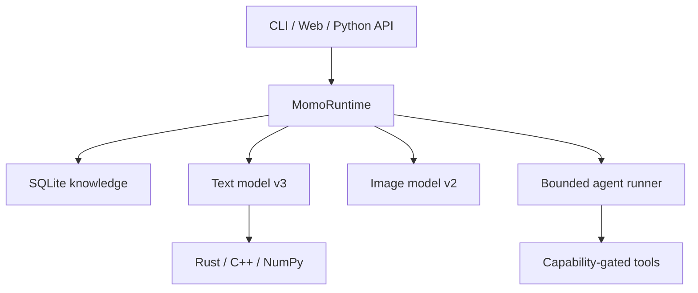

# Momo-LM 架構

Momo-LM 是一套本機參考實作。文字、圖像與工具工作共享 runtime，但各自保存 checkpoint、訓練狀態與限制。專案不呼叫託管 AI API。

## 資料流

`MomoRuntime` 擁有模型與儲存層的生命週期。Web handler 和 CLI 不直接解析 checkpoint，也不直接呼叫 raw pointer ABI。

## 文字模型 v3

Tokenizer 固定為 259 個 token：`PAD`、`BOS`、`EOS` 與 256 個 UTF-8 bytes。預設形狀：

| 項目 | 值 |
|---|---:|
| Context | 128 tokens |
| Embedding | 64 |
| Attention heads | 4 |
| Hidden width | 256 |
| Routed neuron groups | 8 |
| Parameters | 223,835 |

推論流程：

1. 讀取最多 128 個 token，將 token embedding 與 position embedding 相加。
2. 對每個位置的 embedding 執行 RMSNorm。
3. 以 4-head Q／K／V attention pooling 聚合可用的上下文，再加上最後位置 residual。
4. Router 對 8 組神經元產生權重。
5. 每組使用 gated tanh、GELU 或 SiLU 路徑，再與 residual 合併。
6. Output projection 產生 259 維 logits；sampler 執行 temperature、top-k 與 seed 控制。

這是小型 byte-level 模型，不是通用聊天 Transformer。attention 與 neuron routing 增加可測試的模型結構，沒有證據顯示它具備大型模型的知識量或推理品質。

## 文字訓練

訓練器使用 deterministic shuffle、AdamW、global-norm clipping、replay samples 與固定 validation。每個 optimizer step 完成全部可訓練張量的反向傳播。Checkpoint 寫入時採取：

1. 產生臨時 NPZ。
2. 重新以 `allow_pickle=False` 載入並驗證 manifest。
3. 更新 last-good checkpoint。
4. 使用原子檔案替換發布新 checkpoint。

任何載入失敗都不會部分套用張量。壓縮檔與解壓後 byte 數都有上限，避免小型服務因異常 checkpoint 無限制配置記憶體。

## Checkpoint 相容性

- 文字 format v3 保存 shape config、training counters、provenance、metrics 與逐張量 manifest。
- 文字 v1／v2 只接受精確已知的舊 shape，遷移時補齊 v3 張量，再以新格式保存。
- 圖像 format v2 保存 style conditioning 與逐張量 manifest。
- 圖像 v1 只走明確的舊版遷移，不會接受任意 metadata。
- 所有 NPZ 載入都使用 `allow_pickle=False`，metadata 是有界 JSON。

## 原生運算

`TensorBackend` 提供 NumPy reference、CPython C++ extension 與 Rust shared library 的一致介面。ABI v2 的主要 kernels：

- cache-blocked float32 matrix multiplication
- stable softmax
- LayerNorm 與 RMSNorm
- rotary position embedding
- online causal grouped-query attention／decode
- row-wise Q8 quantize/dequantize
- deterministic temperature/top-k sampling
- fused routed neuron groups

Python 路由預設按 Rust、C++、NumPy 的順序選擇。每個 native entrypoint 在使用 pointer 前檢查尺寸、乘法溢位、有限數值與輸出範圍；Python bridge 另外檢查 C-contiguous float32 buffer。詳情見 [NATIVE_CORE.md](NATIVE_CORE.md)。

## 回答路徑

1. `ModManager` 執行 `before_chat`，並處理 `/command`。
2. `KnowledgeStore` 用關鍵詞與 CJK bigram 搜尋 SQLite 文件。
3. 若有明確檢索命中，runtime 將來源片段加入回答上下文。
4. 文字模型生成 next-token sequence，runtime 移除無效控制字元。
5. 資訊過於含糊時，runtime 可回傳釐清問題。
6. `after_chat` 處理回答；若 `learn=True`，再以保守設定加入 replay／增量訓練。

檢索不保證來源正確，生成也不保證忠實引用。高風險領域仍需人工驗證。

## 圖像模型 v2

圖像引擎把 prompt、negative prompt、style 與 seed 編碼成固定 latent。每個輸出座標和週期特徵進入小型 MLP，產生 RGB。大尺寸輸出以 tiles 計算，避免建立不必要的全畫布中間張量。

四個 style 是 conditioning labels，不是四套大型模型。訓練器直接以 NumPy 計算解析梯度，適合檢查資料、backprop 與 checkpoint 流程。它不包含 VAE、U-Net、DiT、CLIP 或 diffusion sampler。

## 代理 runner

代理由 planner、tool registry、SQLite store 與 event stream 組成。Planner 只產生註冊過的步驟類型；runner 在每次工具呼叫前檢查 profile、capability、approval、budget 與取消狀態。寫入型核准是精確且一次性的，不能通配重複使用。

代理不接收 crawler、任意 shell、外部帳號或實體設備工具。Mods 另屬可信任程式碼邊界，並不受到代理 capability sandbox 保護。

## HTTP 邊界

`ThreadingHTTPServer` 提供靜態檔案與 JSON endpoints。部署規則：

- 預設監聽 `127.0.0.1`。
- 非 loopback 綁定需要明確 access token。
- 所有 `/api/`、`/generated/` 與 `/speech/` 請求都驗證 `X-Momo-Token`。
- 驗證 `Host`、`Origin` 與 constant-time token comparison。
- token 只接受長度 1–1024 的可見 ASCII，避免模糊編碼。
- request body、crawl response、checkpoint 與產物都有 byte 限制。
- 靜態與生成檔案先解析路徑，再限制於指定 root。

這些是應用層防護。公開部署仍需 TLS、反向代理、更新管理與網路 ACL。

## 本機儲存

| 資料 | 預設位置 | 格式 |
|---|---|---|
| 文字／圖像權重 | `~/.momo-lm/weights/` | NPZ + bounded JSON metadata |
| 文件與對話 | `~/.momo-lm/data/momo.db` | SQLite |
| 代理工作與事件 | `~/.momo-lm/data/agents.db` | SQLite WAL |
| 代理工作區 | `~/.momo-lm/agent-workspace/` | confined UTF-8 text files |
| 生成圖像 | `~/.momo-lm/generated/` | PNG |
| 語音 | `~/.momo-lm/speech/` | WAV |
| Mods | `~/.momo-lm/mods/` | trusted Python source |

可用 `--home PATH` 為每個實驗建立隔離目錄。SQLite WAL 提供程序中斷後的持久狀態，但不等同跨主機分散式佇列。
